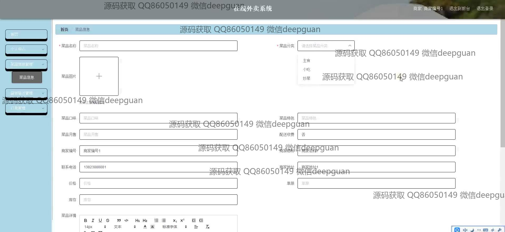
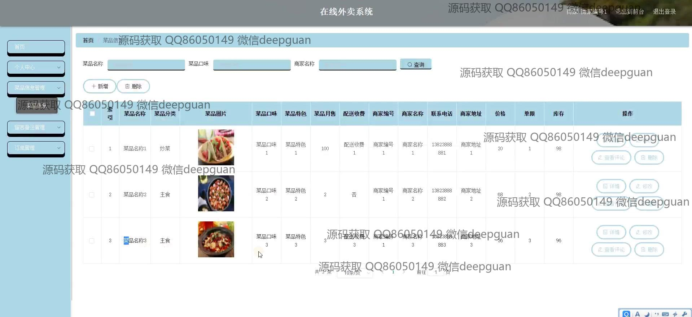

<h1 align="center">在线外卖系统</h1>

## 简介
在线外卖系统：角色分为管理员、用户；提供用户注册、登录、餐厅菜单浏览、菜品订购、支付、订单跟踪和地址管理功能，商家和管理员可进行菜品管理、订单管理和公告发布与管理。    --计算机毕业设计源码；毕设源码；java毕业设计源码

## 联系方式

<h3 align="center">获取完整代码与数据库文件 + 微信：deepguan QQ: 86050149 QQ群: 783742310</h3>

<h3 align="center">可帮忙远程部署 包运行成功！提供远程部署、修改代码、设计文档指导、代码讲解等服务！</h3>

## 功能介绍（完整见运行截图）
管理员：基本功能包括用户管理、商家管理、菜品信息管理、公告管理、留言管理和系统管理等。管理员可添加、修改和删除用户信息，调整商家及菜品分类信息，以及管理订单状态。通过轮播图和公告资讯管理，管理员可以更新系统的视觉内容和公告信息。后台界面提供了方便的导航和操作选项，提升管理效率。

商家：商家可通过系统注册并登录管理界面对其经营内容进行管理，功能包括菜品信息编辑、订单处理和物流管理等。他们可以上传菜品图片和描述，设置价格及库存信息，并查看订单状态和客户信息，以便更好地进行商家服务。此外，还可以通过留言管理与客户进行直接沟通，提高客户满意度。

用户：用户可注册、登录系统，并浏览不同商家的餐品，通过搜索和类别筛选功能查找想要的菜品。用户可以查看菜品详情，将选择的菜品加入购物车并进行订单确认和在线支付。个人中心提供了个人信息查看与修改的功能，包括收货地址管理、订单查询和收藏夹管理，帮助用户更好地管理其个人信息和订单状态。

客服：客服能通过系统中的留言管理功能查看并回复用户的疑问和反馈，帮助解决用户在使用系统时遇到的问题。同时，客服可以协助商家和用户之间的沟通，努力提升用户的体验满意度。通过定期查看订单状况与用户反馈，客服能够为系统提升提供建议，从而进一步提高服务质量。

## 运行截图

本代码来源于网络,仅供学习参考使用!

